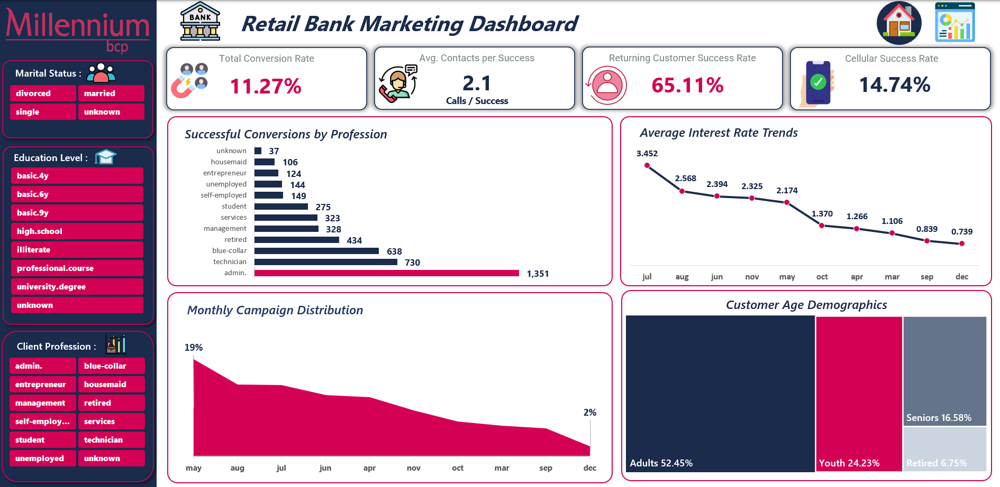

# 🏦 Retail Bank Marketing Analysis Dashboard

## 📌 Project Overview

This project presents an interactive Excel dashboard developed to analyze retail bank marketing campaign performance and identify the factors influencing customer subscription decisions.

The dashboard transforms raw banking marketing data into meaningful insights through KPI tracking, customer segmentation, campaign analysis, and conversion rate evaluation.

---

## 📊 Dashboard Preview

### Retail Bank Marketing Dashboard

### Marketing Performance Analysis Dashboard

---

## 🎯 Business Objectives

- Measure the overall campaign conversion rate.
- Identify the most successful customer segments.
- Analyze the effectiveness of communication channels.
- Evaluate the impact of call duration on conversion.
- Examine customer demographics and campaign performance trends.
- Support data-driven marketing decisions.

---

## 🛠️ Tools Used

- Microsoft Excel
- Pivot Tables
- Pivot Charts
- Slicers
- Data Cleaning
- Data Visualization
- Dashboard Design
- Business Analytics

---

## 📈 Dashboard 1: Retail Bank Marketing Dashboard

### Key KPIs

| Metric | Value |
|----------|----------|
| Total Conversion Rate | 11.27% |
| Average Contacts per Success | 2.1 |
| Returning Customer Success Rate | 65.11% |
| Cellular Success Rate | 14.74% |

### Key Insights

#### Successful Conversions by Profession
- Admin employees achieved the highest number of successful conversions (1,351).
- Technicians ranked second with 730 successful conversions.
- Blue-collar workers generated 638 successful conversions.

#### Interest Rate Trends
- Campaign performance varied across different interest rate periods.
- Higher interest rates showed stronger customer engagement.

#### Customer Age Demographics
- Adults represented the majority of customers (52.45%).
- Youth accounted for 24.23%.
- Seniors represented 16.58%.
- Retired customers accounted for 6.75%.

#### Monthly Campaign Distribution
- Marketing campaigns peaked in May (19%).
- Campaign activity gradually decreased toward December.

---

## 📉 Dashboard 2: Marketing Performance Analysis

### Key KPIs

| Metric | Value |
|----------|----------|
| Best Performing Segment | 31.43% |
| Highest Education Conversion | 13.72% |
| Best Contact Method | 14.74% |
| Strongest Predictor | 65.11% |

### Key Insights

#### Subscription Success Rate by Profession
- Students achieved the highest subscription success rate (31.43%).
- Retired customers followed with 25.26%.
- Unemployed customers achieved 14.20%.

#### Contact Method Effectiveness
- Cellular campaigns achieved a conversion rate of 14.74%.
- Telephone campaigns achieved only 5.23%.
- Cellular communication proved significantly more effective.

#### Campaign Contacts vs Success Rate
- Success rates declined as the number of contacts increased.
- The first few customer interactions delivered the highest conversion rates.

#### Duration vs Success Rate
- Calls longer than 10 minutes achieved the highest conversion rate (48.59%).
- Calls shorter than 2 minutes achieved only 1.28%.

---

## 💡 Business Recommendations

1. Focus marketing efforts on Student and Retired customer segments.
2. Prioritize Cellular communication channels over Telephone campaigns.
3. Encourage longer customer interactions to improve conversion rates.
4. Reduce excessive contact attempts to avoid diminishing returns.
5. Allocate marketing resources toward high-performing customer groups.

---

## 📂 Project Files

- Bank Marketing.xlsx
- README.md
- Dashboard Screenshots

---

## 🚀 Skills Demonstrated

- Data Cleaning
- Data Analysis
- KPI Development
- Dashboard Design
- Data Visualization
- Excel Reporting
- Business Intelligence
- Marketing Analytics

---

## 👨‍💻 Author

**Peter Hany Mousa**

Data Analyst

### Connect With Me

- LinkedIn: https://www.linkedin.com/in/peter-hany1050/
- GitHub: https://github.com/peterhany041

---
⭐ If you found this project useful, feel free to star the repository.
